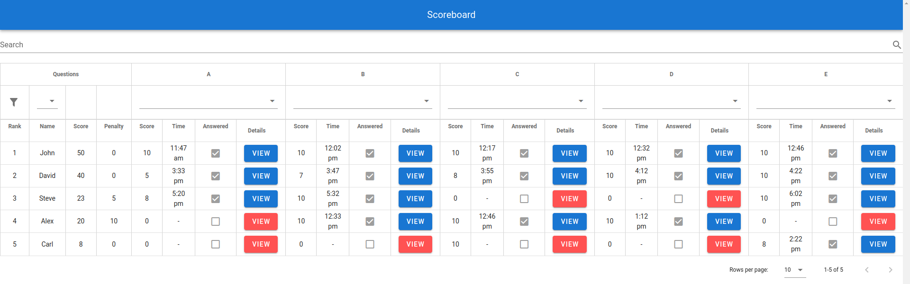
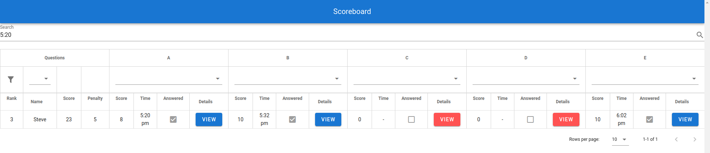
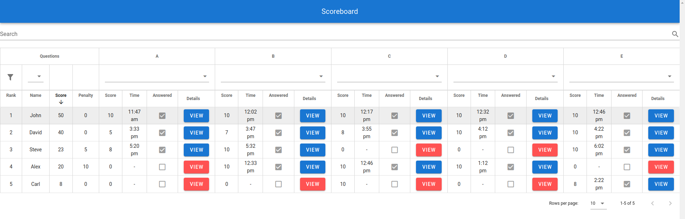
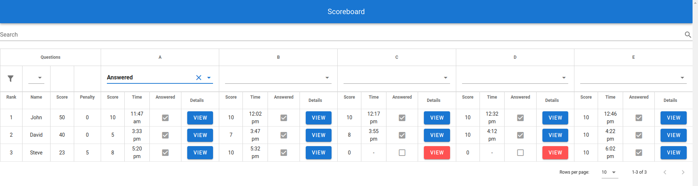
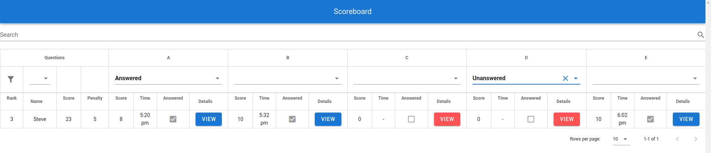
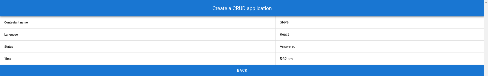
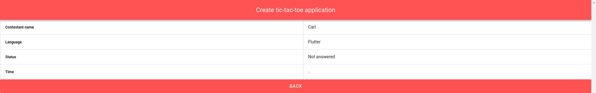

# contest

A Vue.js single page application for browsing the scoreboard of a contest.

Working deployment: https://manankarnik.github.io/contest/

## Screenshots

### Scoreboard Page



#### Search



#### Sort



#### Single Filter



#### Double Filter



### Submissions Page

#### Answered Question



#### Unanswered Question



## Project setup

### Clones repository

```
git clone https://github.com/manankarnik/contest.git
```

### Installs dependencies

```
yarn install
```

### Compiles and hot-reloads for development

```
yarn serve
```

### Compiles and minifies for production

```
yarn build
```

### Lints and fixes files

```
yarn lint
```

### Customize configuration

See [Configuration Reference](https://cli.vuejs.org/config/).
